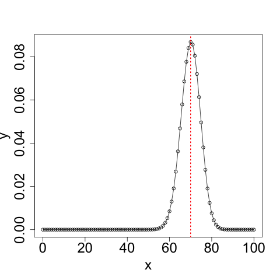
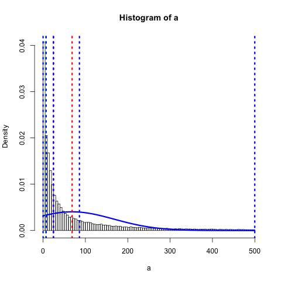
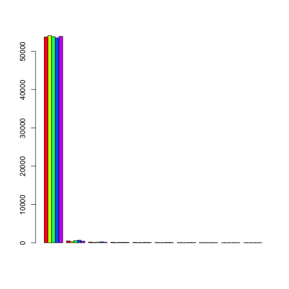
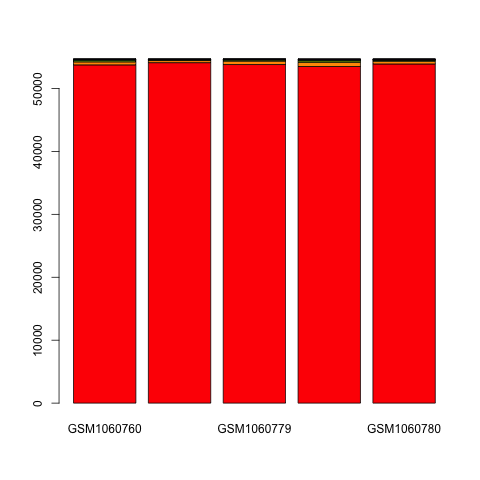
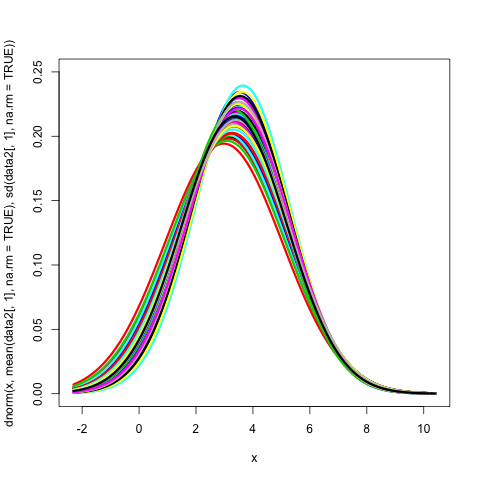

#生物信息统计常用方法与分析流程
[TOC]
## 1. 读取数据
### 安装GEOquery
```
source("http://bioconductor.org/biocLite.R")
biocLite("GEOquery")
```
### 利用GEOquery读取本地数据
```
library(GEOquery)
gdsxxxx <- getGEO(filename='GDSxxxx.soft.gz')
mode(gdsxxxx)
Meta(gdsxxxx)
Columns(gdsxxxx)
data<-Table(gdsxxxx)
colnames(data)
ncol(data)
nrow(data)
```
### 普通读取本地数据表
```
infile = "xxxx.csv"
mydata = read.table(infile,header=TRUE,sep="\t")
#转换格式-有些情况下有必要
mydata <- as.data.frame(mydata)
```
## 2. 数据预处理
### 分类数据提取
```
total <- subset(data,youraim=="XXXX")
```
### 依照某一指标排序
```
male_order <- mydata[order(-mydata$Male.count),]
```
### 并集计算
```
set_u2 <- union(female_set,male_set)
```
### 交集计算
```
set_i2 <- intersect(female_set,male_set)
```
### 交集韦恩图绘制
```
library(VennDiagram)
data1 <- read.table("gene_set1.csv", sep="\t", header=T)
data2 <- read.table("gene_set2.csv", sep="\t", header=T)
inter <- intersect(data1[,1], data2[,1])
head(inter)
lenA <- length(data1[,1])
lenB <- length(data2[,1])
lenAB <- length(inter)
png("x.png")
draw.pairwise.venn(area1=lenA,area2=lenB,cross.area=lenAB,category=c('gene_set1','gene_set2') ,lwd=rep(1,1),lty=rep(2,2),col=c('red','green'),fill=c('red','green'),cat.col=c('red','green'))
dev.off()
```
### 二项分布模拟
```
dbinom(x, size, prob)#该函数给出了每个点的概率密度分布。
pbinom(x, size, prob)#该函数给出事件的累积概率，它用于表示概率的单个值。
qbinom(p, size, prob)#该函数采用概率值，并给出其累积值与概率值匹配的数字。
rbinom(n, size, prob)#该函数从给定样本生成所需数量的给定概率的随机值。
参数的描述:
x - 是数字的向量，p - 是概率向量，n - 是观察次数，size - 是试验的次数， prob - 是每次试验成功的概率。
```
### 概率密度疗效图
```
#计算概率密度分布
x <- seq(0,100,by = 1)
y <- dbinom(x,100,0.7)
#定义图片名称
png(file = "dbinom-drug2.png") 
#绘制概率密度分布的散点图 
#并设定坐标轴字体大小为2 #横坐标标题设为“治疗有效率”【自行设定】 #纵坐标标题设为“概率密度分布”【自行设定]
plot(x,y,cex.axis=2,cex.lab=2) #绘制概率密度分布的连线图
lines(x,y)
#添加一条总体治疗有效率的垂直虚线x=88，线宽为2，颜色红色
abline(v=88,lty=3,lwd=2,col="red")
#保存图片
dev.off()
```

### 随机抽样
```
#去除标题列的干扰【前两列】 
data2<-data[,3:67] 

#随机抽取至少 5 列数据
n=5
#得到列名称【标题行】 
col.name=colnames(data2) 
#按列随机抽样
sam.col.name = sample(col.name,n,replace=F) #查看抽样结果
sam.col.name 

#按行随机抽样
row.name=rownames(data2)
sam.row.name = sample(row.name,n,replace=F)

#提取子数据集
sub.data <- data2[, sam.col.name]
```
## 3. 基因表达水平情况概览（分析流程）
## · 读取数据
```
library(GEOquery)
gds4794 <- getGEO(filename='GDS4794.gz')

data<-Table(gds4794)
ncol(data)
nrow(data)
data2<-data[,3:67]
n=1
col.name=colnames(data2)
sam.col.name = sample(col.name,n,replace=F)
sam.col.name = "GSM1060766"
sub.data <- data2[, sam.col.name]
a <-sub.data[sub.data<500]
```
## · 各统计指标计算
```
x1<-min(a,na.rm=TRUE) # 计算最小值 
x2<-max(a,na.rm=TRUE) # 计算最大值 
ave<-mean(a,na.rm=TRUE) # 计算均值 
med<-median(a,na.rm=TRUE) # 计算中位数
# 连续分布的众数定义为其分布的密度函数峰值对应的取值 
ds=density(a,na.rm=TRUE)
mode <- ds$x[which.max(ds$y)]
quan<-quantile(a,na.rm=TRUE) # 计算四分位数 (0%,25%,50%,75%,100%) 
```
## · 绘制频率分布直方图
```
dnorm_png<-png("d1-means-medium-mode-test.png") # 定义图片文档
hist(a, freq = F, breaks = 100) # 绘制频率分布直方图 
curve(dnorm(x,mean(a,na.rm=TRUE), sd(a,na.rm=TRUE)), xlim=c(x1,x2), col="blue", lwd=3, add=TRUE) # 绘制概率分布曲线 
abline(v=ave,lty=3,lwd=3,col="red") # 增加均值线 
abline(v=med,lty=3,lwd=3,col="purple") # 增加中位数线 
abline(v=mode,lty=3,lwd=3,col="green") # 增加众数线 
abline(v=quan,lty=3,lwd=3,col="blue") # 增加四分位数线
dev.off() # 保存图片文档
```

## · 堆积图
```
n=5
sam.col.name = sample(col.name,n,replace=F)
sam.col.name

a <- data2[, sam.col.name]
freq = matrix(rep(0,50),10,5) # 初始化频数矩阵 
for(i in 1:5){
x <-table(as.numeric(cut(a[,i],10))) 
y <- as.data.frame(x)
freq[,i] <- y[,2]
}
colnames(freq)<-colnames(a) # 列名
#besides=T 时,单列数据中的每个值没有堆积起来,相邻排列,众坐标显 示的每个数值。
png(file = "barplot.png") 
barplot(t(freq),beside=T,col=rainbow(5))
dev.off()
# 堆积
png(file = "barplot2.png")
barplot(freq,col=rainbow(10))
dev.off()
```


## · 频率分布曲线图
 ```
data<-Table(gds4794)
data2 <- log(data[,3:67])
x1<-min(data2,na.rm=TRUE) 
x2<-max(data2,na.rm=TRUE) 
y_max<-0.25 
dnorm_png<-png("all-hist.png")
curve(dnorm(x,mean(data2[,1],na.rm=TRUE), sd(data2[,1],na.rm=TRUE)), xlim=c(x1,x2), ylim=c(0,y_max), col=1, lwd=3)
for (i in 2:ncol(data2))
{
curve(dnorm(x,mean(data2[,i], na.rm=TRUE), sd(data2[,i], na.rm=TRUE)), add=TRUE , xlim=c(x1,x2), ylim=c(0,y_max), col=i, lwd=3)
}
dev.off()
 ```
 
## · 数据标准化处理
取log，之后操作如上  
中间也可以绘制boxplot查看整体分布状况  
