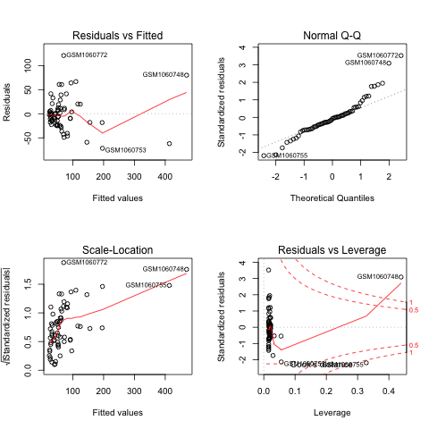
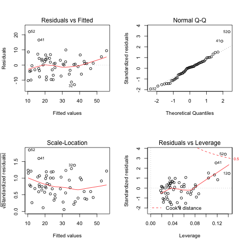

## 生物信息统计常用方法与分析流程
## 目录
* [读取数据](#1)
* [数据预处理](#2)
* [基因表达水平情况概览（分析流程）](#3)
* [一般性分类数据分析流程](#4)
* [列联表数据分析流程](#5)
* [基因相关性分析](#6)
* [基因整体关系分析（主成分分析与聚类分析）](#7)
* [时间序列数据分析](#8)

## <a id="1"></a>1. 读取数据
### 安装GEOquery
```
source("http://bioconductor.org/biocLite.R")
biocLite("GEOquery")
```
### 利用GEOquery读取本地数据
```
library(GEOquery)
gdsxxxx <- getGEO(filename='GDSxxxx.soft.gz')
mode(gdsxxxx)
Meta(gdsxxxx)
Columns(gdsxxxx)
data<-Table(gdsxxxx)
colnames(data)
ncol(data)
nrow(data)
```
### 普通读取本地数据表
```
infile = "xxxx.csv"
mydata = read.table(infile,header=TRUE,sep="\t")
#转换格式-有些情况下有必要
mydata <- as.data.frame(mydata)
```
## <a id="2"></a>2. 数据预处理
### 分类数据提取
```
total <- subset(data,youraim=="XXXX")
```
### 依照某一指标排序
```
male_order <- mydata[order(-mydata$Male.count),]
```
### 并集计算
```
set_u2 <- union(female_set,male_set)
```
### 交集计算
```
set_i2 <- intersect(female_set,male_set)
```
### 交集韦恩图绘制
```
library(VennDiagram)
data1 <- read.table("gene_set1.csv", sep="\t", header=T)
data2 <- read.table("gene_set2.csv", sep="\t", header=T)
inter <- intersect(data1[,1], data2[,1])
head(inter)
lenA <- length(data1[,1])
lenB <- length(data2[,1])
lenAB <- length(inter)
png("x.png")
draw.pairwise.venn(area1=lenA,area2=lenB,cross.area=lenAB,category=c('gene_set1','gene_set2') ,lwd=rep(1,1),lty=rep(2,2),col=c('red','green'),fill=c('red','green'),cat.col=c('red','green'))
dev.off()
```
### 二项分布模拟
```
dbinom(x, size, prob)#该函数给出了每个点的概率密度分布。
pbinom(x, size, prob)#该函数给出事件的累积概率，它用于表示概率的单个值。
qbinom(p, size, prob)#该函数采用概率值，并给出其累积值与概率值匹配的数字。
rbinom(n, size, prob)#该函数从给定样本生成所需数量的给定概率的随机值。
参数的描述:
x - 是数字的向量，p - 是概率向量，n - 是观察次数，size - 是试验的次数， prob - 是每次试验成功的概率。
```
### 概率密度疗效图
```
#计算概率密度分布
x <- seq(0,100,by = 1)
y <- dbinom(x,100,0.7)
#定义图片名称
png(file = "dbinom-drug2.png") 
#绘制概率密度分布的散点图 
#并设定坐标轴字体大小为2 #横坐标标题设为“治疗有效率”【自行设定】 #纵坐标标题设为“概率密度分布”【自行设定]
plot(x,y,cex.axis=2,cex.lab=2) #绘制概率密度分布的连线图
lines(x,y)
#添加一条总体治疗有效率的垂直虚线x=88，线宽为2，颜色红色
abline(v=88,lty=3,lwd=2,col="red")
#保存图片
dev.off()
```

### 随机抽样
```
#去除标题列的干扰【前两列】 
data2<-data[,3:67] 

#随机抽取至少 5 列数据
n=5
#得到列名称【标题行】 
col.name=colnames(data2) 
#按列随机抽样
sam.col.name = sample(col.name,n,replace=F) #查看抽样结果
sam.col.name 

#按行随机抽样
row.name=rownames(data2)
sam.row.name = sample(row.name,n,replace=F)

#提取子数据集
sub.data <- data2[, sam.col.name]

#重复抽样100次
x <- replicate(100, sample(a, size=100, replace = FALSE))
```
## <a id="3"></a>3. 基因表达水平情况概览（分析流程）
### · 读取数据
```
library(GEOquery)
gds4794 <- getGEO(filename='GDS4794.gz')

data<-Table(gds4794)
ncol(data)
nrow(data)
data2<-data[,3:67]
n=1
col.name=colnames(data2)
sam.col.name = sample(col.name,n,replace=F)
sam.col.name = "GSM1060766"
sub.data <- data2[, sam.col.name]
a <-sub.data[sub.data<500]
```
### · 各统计指标计算
```
x1<-min(a,na.rm=TRUE) # 计算最小值 
x2<-max(a,na.rm=TRUE) # 计算最大值 
ave<-mean(a,na.rm=TRUE) # 计算均值 
med<-median(a,na.rm=TRUE) # 计算中位数
# 连续分布的众数定义为其分布的密度函数峰值对应的取值 
ds=density(a,na.rm=TRUE)
mode <- ds$x[which.max(ds$y)]
quan<-quantile(a,na.rm=TRUE) # 计算四分位数 (0%,25%,50%,75%,100%) 
```
### · 绘制频率分布直方图
```
dnorm_png<-png("d1-means-medium-mode-test.png") # 定义图片文档
hist(a, freq = F, breaks = 100) # 绘制频率分布直方图 
curve(dnorm(x,mean(a,na.rm=TRUE), sd(a,na.rm=TRUE)), xlim=c(x1,x2), col="blue", lwd=3, add=TRUE) # 绘制概率分布曲线 
abline(v=ave,lty=3,lwd=3,col="red") # 增加均值线 
abline(v=med,lty=3,lwd=3,col="purple") # 增加中位数线 
abline(v=mode,lty=3,lwd=3,col="green") # 增加众数线 
abline(v=quan,lty=3,lwd=3,col="blue") # 增加四分位数线
dev.off() # 保存图片文档
```

### · 堆积图
```
n=5
sam.col.name = sample(col.name,n,replace=F)
sam.col.name

a <- data2[, sam.col.name]
freq = matrix(rep(0,50),10,5) # 初始化频数矩阵 
for(i in 1:5){
x <-table(as.numeric(cut(a[,i],10))) 
y <- as.data.frame(x)
freq[,i] <- y[,2]
}
colnames(freq)<-colnames(a) # 列名
#besides=T 时,单列数据中的每个值没有堆积起来,相邻排列,众坐标显 示的每个数值。
png(file = "barplot.png") 
barplot(t(freq),beside=T,col=rainbow(5))
dev.off()
# 堆积
png(file = "barplot2.png")
barplot(freq,col=rainbow(10))
dev.off()
```


### · 概率分布曲线图
 ```
data<-Table(gds4794)
data2 <- log(data[,3:67])
x1<-min(data2,na.rm=TRUE) 
x2<-max(data2,na.rm=TRUE) 
y_max<-0.25 
dnorm_png<-png("all-hist.png")
curve(dnorm(x,mean(data2[,1],na.rm=TRUE), sd(data2[,1],na.rm=TRUE)), xlim=c(x1,x2), ylim=c(0,y_max), col=1, lwd=3)
for (i in 2:ncol(data2))
{
curve(dnorm(x,mean(data2[,i], na.rm=TRUE), sd(data2[,i], na.rm=TRUE)), add=TRUE , xlim=c(x1,x2), ylim=c(0,y_max), col=i, lwd=3)
}
dev.off()
 ```
 
### · 数据标准化处理
取log，之后操作如上  
中间也可以绘制boxplot查看整体分布状况  
## <a id="4"></a>4. 一般性分类数据分析流程
### · 首先可绘制整体boxplot观察大体情况，然后进行下述操作
### · 正态性检验
```
shapiro.test(x)
```
### · 方差齐性检验
```
bartlett.test(x)#适用于服从正态分布的数据，且容易造成假阳性判断

#9个对象，4种频率【9行4列】（自己按条件修改参数）
data2<-data.frame(X=c(data[,2],data[,3],data[,4],data[,5]), A=factor(rep(1:4,rep(9,4))))

library(car)
leveneTest(X~A,data=data2)#更为稳健的方差齐性检验方法

fligner.test(X~A,data=data2)#非参数的检验方法，完全不依赖于对分布的假设
```
### · t检验
```
#随机数生成
set.seed(1)
a<-seq(0,100,length.out=100)
set.seed(2)
b<-seq(0,100,length.out=100)
#t 检验
t.test(a,b,var.equal=TRUE) #等方差t检验
t.test(a,b) #异方差 t 检验

#H0:μ1=μ2, H1:μ1<μ2【等方差单侧检验】
t.test(x, y, var.equal=TRUE, alternative = "less")

#H0:μ1=μ2, H1:μ1<μ2【t'检验(异方差单侧检验-Welch t检验)】
t.test(x,y, alternative = "less")

#H0:μ1=μ2, H1:μ1≠μ2【等方差双侧检验】
t.test(x2, y2, var.equal=TRUE, alternative = "two.sided")

#H0:μ1=μ2, H1:μ1≠2【t'检验(异方差双侧检验-Welch t检验)】
t.test(x2,y2, alternative = "two.sided")
```
### · Wilcoxon符号秩和检验
```
#H0:M1=M2, H1:M1≠M2【双侧】
wilcox.test(x2, y2, alternative = "two.sided")

#H0:M1=M2, H1:M1<M2【单侧】
wilcox.test(x, y, alternative = "less")
```
### · Kruskal-Wallis检验（一组多个独立样本的秩和检验）
```
install.packages("agricolae")
library( agricolae)
#H0:M1=M2=M3, H1:三者不等
kruskal.test(X~A,data=data2)

#单因素方差分析
#多重比较
```
### · Friedman检验（多组样本的秩和检验）
```
apply(data[,2:5],2,shapiro.test)#正态性检验

#然后方差齐性检验

dm<-as.matrix(data[,2:5])
dimnames(dm) <- list(1:9, c("A", "B", "C", "D"))
friedman.test(dm)#Friedman检验

#单因素方差分析
m<-aov(X~A,data=data2)
summary(m）

#多重比较
mm<-TukeyHSD(m)
mm
png("e12_data-3-1_TurkeyHSD_plot.png")
plot(mm)
dev.off()
```

## <a id="5"></a>5. 列联表数据分析流程
等位基因频率 | 高血压组(n=218) | 对照组(n=301)  
----|----|----
I | 52.9%(115) | 40.1%(121)
V | 47.1%(103) | 59.9%(180)
基因型频率 |
II | 7.8%(17) | 15.9%(48)
IV | 90.4%(197) | 48.5%(146)
VV | 1.8%(4) | 35.5%(107)
### · Kappa一致性测量
```
#等位基因频率的 Kappa 一致性测量
x<-cbind(c(115,103),c(121,180))
library(vcd)
Kappa(x)
```
### · 卡方检验
```
#等位基因频率
x<-cbind(c(115,103),c(121,180))
chisq.test(x,correct=F)#卡方独立性检验/等比例检验

x<-c(121,180)
p<-c(52.9,47.1)
chisq.test(x, p = p, rescale.p = TRUE)#卡方拟合优先度检验
```
### · 转化列联表为2*2格式
---- | 高血压(D+) | 对照组(D-) | 合计
----|----|----|----
IV(E+) | 197 | 146 | 343
II+IV(E-) | 21 | 155 | 176
合计 | 218 | 301 | 519
### · 风险比、概率比、使用概率计算的几率比
```
RR = (197/343)/(21/176) = 4.81355
OR = (197*155)/(21*146) = 9.95923
p1=p(D+|E+)=197/343 = 0.57 -> odds1 = p1(1-p1) = 0.25
p2=p(D+|E-)=21/176 = 0.12 -> odds2 = p2(1-p2) = 0.11
OR' = odds1/odds2 = 2.27
``` 
### · 样本量的计算
```
调查高血压组中IV基因型的比例(± 5%区间)，α=0.05，π=0.9
n = (1.96/0.05)2 × (0.9×0.1) = 138.2976 ≈ 139

调查高血压组中IV基因型的比例(± 2.5%区间)，α=0.05，π=0.9
n = (1.96/0.025)2 × (0.9×0.1) = 553.1904 ≈ 554
->要求比例越接近真实情况，样本量需求越大

调查对照组中IV基因型的比例(± 2.5%区间)，α=0.05，π=0.5
n = (1.96/0.025)2 × (0.5×0.5) = 1536.64 ≈ 1537
->不同基因型比例分布越均匀，样本量需求越大
```
### · 若是表中出现极端数据，则使用Fisher精确检验
```
fisher.test()
```
## <a id="6"></a>6. 基因相关性分析
### · Pearson相关性分析
```
#变量初始化，用来存放计算结果中的 p.value 和相关系数 cor 值
p <- NULL
r <- NULL
a <- unlist(data[sam.row.name,3:67])
gene_name_a <- as.character(data[sam.row.name,2])

for(i in 1:nrow(data)) {
	if(rownames(data)[i] != sam.row.name) {
		b <- unlist(data[i,3:67])
		#pearson 相关系数计算及显著性检验
		x <- cor.test(a,b, method="pearson")
		p <- c(p,x$p.value)
		r <- c(r,x$estimate)
	}
}

datanames <- data[data$ID_REF!=sam.row.name,2]
names(p)<-datanames
names(r)<-datanames

#设定阈值进行筛选
p_value = 0.05
r_cutoff = 0.5
#筛选
p2 <- p[p<p_value]
r2 <- r[r>r_cutoff]
#查看筛选结果
length(p2)
length(r2)

#计算 p2 和 r2 相关基因名称的交集->与数据行 a 对应基因表达水平具有较高相关性的基因
genes <- intersect(names(p2),names(r2))
length(genes)
tail(genes)#查看有无非法项

#合并有效基因名称
genes2 <-c(gene_name_a,genes[1:787]) #输出基因名称
out = "pearson-related-genes.csv"
write.table(genes2,out)
```
### · 线性回归分析
```
rownames(data)<-data[,1]
#随机抽取 1 行数据
n=1
#按行随机抽样
row.name = rownames(data)
sam.row.name = sample(row.name,n,replace=F)
sam.row.name #查看抽中的数据行【记录】
a <- unlist(data[sam.row.name,3:67])
gene_name_a <- as.character(data[sam.row.name,2])
gene_name_a #查看抽中的数据行【记录】

p=NULL
r=NULL
xl=NULL
jj=NULL
#基因表达谱遍历
for(i in 1:nrow(data)){
	if(rownames(data)[i] != sam.row.name){
		b <- unlist(data[i,3:67])
		c <- lm(a~b+1)
		p <- c(p,pf(as.numeric(summary(lm.sol)$fstatistic[1]), as.numeric(summary(lm.sol)$fstatistic[2]), as.numeric(summary(lm.sol)$fstatistic[3]), lower.tail = FALSE))
		r <- c(r,summary(c)$r.squared)
		jj <- c(jj,summary(c)$coef[1,1])
		xl <- c(xl,summary(c)$coef[2,1])
	}
}
datanames <- data[data$ID_REF!=sam.row.name,2]
dataids <- data[data$ID_REF!=sam.row.name,1]
names(p)<-datanames
names(r)<-datanames
names(jj)<-datanames
names(xl)<-datanames

target <- cbind.data.frame(dataids,datanames,xl,jj,r,p)

#设定阈值进行筛选
p_value = 0.001
r_cutoff = 0.7
#筛选

p2 <- p[p<p_value]
r2 <- r[r>r_cutoff]
result <- target[target$p<p_value&target$r>r_cutoff,1:6]
out = "regression-genes.csv"
write.csv(result,out,row.names=F)
```
```
#线性回归统计图
maxr <- max(result$r)
maxgene <- result[result$r==maxr,1]
maxgene
aimgene <- unlist(data["221239_s_at",3:67])
finalresult <- lm(a~aimgene+1)
png("regression.png")
par(mfrow=c(2,2))
plot(finalresult)
dev.off()
```


### · 单因素方差分析
```
aov(a~aimgene)
```
### · 多因素方差分析
```
rownames(data)<-data[,1]
n=1#随机抽取至少 1 列数据
row.names<-rownames(data)
sam.row.name <- sample(row.names,n,replace=F)
#sam.row.name <- "LIMN_1790218"
ge<-data.frame(x<-t(data[sam.row.name,3:14]), A<- factor(substring(Columns(gds6100)$protocol,1,9)), B<- factor(substring(Columns(gds6100)$time,6)))
shapiro.test(x)#正态性检验
bartlett.test(x~A,data=ge)#方差齐性检验
bartlett.test(x~B,data=ge)#方差齐性检验

#绘图查看数据分布规律
png("3.png")
par(mfrow=c(2,2),las=2, cex.axis=1.2, cex.lab=1.2) 
plot(x~A+B,data=ge)
#attach(ge)
interaction.plot(A,B,x,legend=F) 
interaction.plot(B,A,x,legend=F)
dev.off()

#不考虑交互作用
ge.aov<-aov(x~A+B,data=ge)
summary(ge.aov)

#考虑交互作用
ge.aov2<-aov(x~A*B,data=ge)
summary(ge.aov2)
```
### · 协方差分析
```
row.names<-rownames(data)
sam.row.name <- sample(row.names,n,replace=F)
n <- 1
ge<-data.frame(y<-t(data[sam.row.name,3:14]), A<-
factor(substring(Columns(gds6100)$protocol,1,9)), x<-
as.numeric(substring(Columns(gds6100)$time,6)))
ge
#正态性检验
shapiro.test(y)
#方差齐性检验
bartlett.test(y~A,data=ge)
bartlett.test(y~x,data=ge)

#绘图查看数据特征
par(mfrow=c(2,2),las=2, cex.axis=1.2, cex.lab=1.2)
plot(y~x+A,data=ge)
#attach(ge)
interaction.plot(x,A,y,legend=F)
interaction.plot(A,x,y,legend=F)
#不考虑交互作用
ge.aov<-aov(y~x+A,data=ge)
summary(ge.aov) #查看协方差分析后的统计评估图-4 张 
par(mfrow=c(2,2), cex.axis=1.2, cex.lab=1.2) 
plot(ge.aov)
 
#考虑交互作用
ge.aov2<-aov(y~x:A,data=ge)
summary(ge.aov2) #查看协方差分析后的统计评估图-4 张 
par(mfrow=c(2,2), cex.axis=1.2, cex.lab=1.2) 
plot(ge.aov2)
```


### · 多元线性回归分析
```
#两两组合绘制散点图和拟合曲线，从总体上看看不同变量之间的关联
png("lec10_Healthy_Breakfast_pairs.png")
pairs(data[,4:16],panel=panel.smooth)
dev.off()
```


```
#以“rating”数据列为因变量(y),对其他所有数据列进行多元回归分析
lm0<-lm(rating~.,data=data[,4:16])
summary(lm0)

#以【向后】逐步回归法计算最终多元回归模型(记录逐步回归的结果)
lm.step<-step(lm0,direction="backward")
summary(lm.step)

#查看回归结果的统计图谱
png(file = "lec10_Healthy_Breakfast_lm_data.png") par(mfrow=c(2,2))
plot(lm.step)
dev.off()
```


```
#多重共线性分析
library(car)
vif(lm.step)
#理想中的线性模型各个自变量应该是线性无关的，若自变量间存在共线性，则会降低回归系数的准确性。一般用方差膨胀因子VIF(Variance Inflation Factor)来衡量共线性，《统计学习》中认为 VIF 超过 5 或 10 就存在共线性，《R语言实战》中认为 VIF 大于 4 则存在共线性。理想中的线性模型 VIF=1，表 完全不存在共线性。
```
```
#检查离群点、高杠杆点、强影响点
#纵坐标超过+2 或小于-2 的点可被认为是离群点
#水平轴超过 0.2 或 0.3 的就 是高杠杆值(通常为预测值的组合)。
#圆圈大小与影响成比例，圆圈很大的点可能是对模型参数的估计造成的不成比例影响的强影响点。
png("lec10_Healthy_Breakfast_influencePlot.png")
influencePlot(lm.step,id.method = "identity", main="Influence Plot", sub="Circle size is proportional to Cook's distance")
dev.off()
```


```
#若需要转换哑变量
#将该数据表的第 2(mfr)和 3(type)两列数据，转换为哑变量(Proxy and dummy variables)，与4:16列重新组合成一个新的数据表;

#新的数据矩阵共有 16-3+6+1=20列
data2<-data.frame(matrix(NA,77,20))
#哑变量转换
for(i in 1:nrow(data)) {
	#第二列 mfr 分类
	if(data[i,2]=="A"){data2[i,1:6]<-c(0,0,0,0,0,0)} 
	if(data[i,2]=="G"){data2[i,1:6]<-c(1,0,0,0,0,0)} 
	if(data[i,2]=="K"){data2[i,1:6]<-c(0,1,0,0,0,0)} 
	if(data[i,2]=="N"){data2[i,1:6]<-c(0,0,1,0,0,0)} 
	if(data[i,2]=="P"){data2[i,1:6]<-c(0,0,0,1,0,0)} 
	if(data[i,2]=="Q"){data2[i,1:6]<-c(0,0,0,0,1,0)} 
	if(data[i,2]=="R"){data2[i,1:6]<-c(0,0,0,0,0,1)}
	#第三列 type 分类
	if(data[i,3]=="C"){data2[i,7]<-0} 
	if(data[i,3]=="H"){data2[i,7]<-1}
}
#还有原第 4:16 列数据
data2[,8:20]<-data[,4:16]

#将原数据表的第一列数据作为新数据表的行标题，列标题作为新数据表相应列的列标题
rownames(data2)<-data[,1]
colnames(data2)<-c(paste("mfr_",c("G","K","N","P","Q","R"),sep=""),"type_CH",colnames(data)[4:16])

#之后操作同上
```
### · Logistic回归
```
#随机抽取至少 10 行数据
n=10 
#使用以下代码进行循环测试:齐方差、F检验，p>0.1;齐方差、F检验，双因素p<0.1，无 交互作用;齐方差、F 检验，双因素 p 无要求，p<0.1 
#按行随机抽样【实验结果中需要记录】
row.names<-rownames(data)
sam.row.name <- sample(row.names,n,replace=F)

sam.row.name #查看抽中的数据行探针id
subdata<-data[sam.row.name,3:67] #提取抽样数据

#加上样本病理类型数据共 n+1 列
#初始化数据表
data2<-data.frame(matrix(NA,65, n+1)) #增加样本病理类型分类数据，肺癌=1，其他正常=0
data2[,1]<-c(rep(1,23),rep(0,42))
data2[,2:(n+1)]<-t(log(subdata)) #后面n列存放筛选出来的基因数据，注意矩阵行列 转换
colnames(data2)<-c("y",paste("x",1:n,sep="")) #设定列标题y,x1,x2,...,x10

glm0<-glm(y~.,family=binomial(link='logit'),data=data2)
summary(glm0)

#向后逐步回归法 
glm.step<-step(glm0,direction="backward") 
summary(glm.step)

#绘制回归评估的 4 张图 
png(file = "glm4.png") 
par(mfrow=c(2,2)) 
plot(glm.step) 
dev.off()

#car 包里的 influencePlot()函数能一次性同时检查离群点、高杠杆点、强影响点 
library(car)
png("influencePlot.png")
influencePlot(glm.step,id.method = "identity", main="Influence Plot", sub="Circle size is proportional to Cook's distance")
dev.off()

#绘制 subdata 的热图 
colnames(subdata)<-Columns(gds4794)$disease.state 
png(file = "heatmap1.png") 
heatmap(as.matrix(log(subdata)), Rowv = NA, Colv = NA) 
dev.off()
```


### · 多项式回归
```
#设定颜色梯度区间并观察整体分布情况
a<-max(data$JanTemp) - min(data$JanTemp) + 1 
png(file = "plot_y_x_t_scatter.png")
cPal <- colorRampPalette(c('green','red'))
Cols <- cPal(a)[as.numeric(cut(data$JanTemp,breaks = a))] 
plot(data$Long,data$Lat,pch = 20,col = Cols,cex=2)
dev.off()
```


```
#局部多项式回归拟合探索
#用loess来建立模型时重要的两个参数是span和degree，span表示数据子集的获取范围，取值越大则数据子集越多，曲线越为平滑。degree表示局部回归中的阶数，1表示线性回归，2表示二次回归(默认)，也可以取0，此时曲线退化为简单移动平均线

#JanTemp~Long拟合 
model2=loess(JanTemp~Long,data=data,span=0.8) 
summary(model2)
png(file = "plot_T_Long_loess.png")
plot(data$JanTemp~data$Long,pch = 20,col = Cols,cex=2)
lines(data$Long,model2$fit,col='red',lty=2,lwd=2)
dev.off()
```


```
#二元线性回归的探索 
lm.line<-lm(JanTemp~Lat+Long,data=data) 
summary(lm.line) 
png(file = "plot_y_x_t_lm.png")
par(mfrow=c(2,2))
plot(lm.line)
dev.off()
```


```
#Lat为线性，Long为三次项
model <- lm(JanTemp ~ Lat + poly(Long,3),data=data)
summary(model)
#模型参数的置信区间 
confint(model, level=0.95)
#拟合VS残差图,如果这是一个拟合效果比较不错的模型，应该看不到任何一种模型的特征 
png(file = "plot_T_Lat_Long_model_residuals.png")
#par(mfrow=c(2,2))
plot(model)
plot(fitted(model),residuals(model))
dev.off()
```


## <a id="7"></a>7. 基因整体关系分析（主成分分析与聚类分析)
### · 主成成分分析
```
#分析各门课程成绩之间的相关性
#一次性计算所有列数据两两之间的相关系数
library(psych)
corr.test(data)
```
```
#数据的标准化处理前后的对比
#原数据: 
png("boxplot1.png") 
boxplot(data,las=2) 
dev.off()

#数据中心化，使其均值变为零【原点】 
data2<-scale(data, center=T,scale=F) 
data2
png("lboxplot2.png") 
boxplot(data2,las=2)
dev.off()
#数据围绕 0 附近波动，但是方差变异很大

#数据标准化，除以方差 
data3<-scale(data, center=T, scale=T) 
data3
png("boxplot3.png") 
boxplot(data3,las=2)
dev.off()
```
```
#标准化数据协方差矩阵的计算
mc<-cov(data3)
mc
```
```
#主成分分析
#cor:逻辑变量，若为cor=T表示用样本的相关矩阵R作主成分分析，cor=F, 表示用样本的协方差矩阵 s 作为主成分分析
pca<-princomp(data,cor=T)
pca2<-princomp(data2,cor=T)
pca3<-princomp(data3,cor=T)
#以上几个结果相同，princomp 自动进行上述中心化和标准化处理 
pca

#观察主成分分析的摘要信息:
#保留变异累计达到 90%(四舍五入)的几个主成分信息。
summary(pca)
pca[]#查看详细信息
pca$sdev #Standard deviation 
pca$loadings #loading系数矩阵 
pca$center #每一门课程均值=》数据中心化 
pca$scale #每一门课程方差=》数据标准化
pca$scores #每个样本每个组分的得分
pca$loadings #查看loadins信息
pca$loadings[] #查看loadings全部数值 #计算得到各个样本主成分的数据->等价于 pca$scores 
pca_data <- predict(pca)
```
```
#绘图查看主成分的变异贡献度
#针对 princomp()对象的 plot 方法# #该方法可以绘制展示每个主成分与其自身方差贡献度相关性的悬崖碎石图。 
png("lec12_bar-stone_plot1.png",width=600*3,height=3*300,res=72*3) 
par(mfrow=c(1,2),las=2)
#条形图
plot(pca)
abline(h=1,type="2",col="red")
#主成分的碎石图
screeplot(pca, type="lines")
abline(h=1,type="2",col="red")
dev.off()
```


```
#绘制得分(scores)图:
#了解新变量(主成分)数值对 30 个同学的区分程度到底如何。
#=》主成分分布更为离散=》把 30 个样本区分的更好
#得分图(Score plot) 
png("lec12_15scores_scores_plot6.png",width=600*3,height=3*400,res=72*3) 
par(mfrow=c(2,3))
#主成分分析之后的前两个主成分得分绘图
plot(pca$scores[,1], pca$scores[,2],type="n") 
text(pca$scores[,1],pca$scores[,2],labels=rownames(pca$scores),cex=0.8) 
plot(pca$scores[,1], pca$scores[,3],type="n") 
text(pca$scores[,1],pca$scores[,3],labels=rownames(pca$scores),cex=0.8) 
plot(pca$scores[,1], pca$scores[,4],type="n") 
text(pca$scores[,1],pca$scores[,4],labels=rownames(pca$scores),cex=0.8) 
plot(pca$scores[,2], pca$scores[,3],type="n") 
text(pca$scores[,2],pca$scores[,3],labels=rownames(pca$scores),cex=0.8) 
plot(pca$scores[,2], pca$scores[,4],type="n") 
text(pca$scores[,2],pca$scores[,4],labels=rownames(pca$scores),cex=0.8) 
plot(pca$scores[,3], pca$scores[,4],type="n") 
text(pca$scores[,3],pca$scores[,4],labels=rownames(pca$scores),cex=0.8) 
dev.off()
```


```
#绘制载荷(loadings)图: 了解新变量(主成分)与原变量(不同课程)之间的关系。
png("lec12_15scores_loadings_plot6.png",width=600*3,height=3*400,res=72*3) 
par(mfrow=c(2,3))
#主成分分析之后的前两个主成分得分绘图
plot(pca$loadings[,1], pca$loadings[,2],type="n")
text(pca$loadings[,1],pca$loadings[,2],labels=rownames(pca$loadings),cex=0.8)
plot(pca$loadings[,1], pca$loadings[,3],type="n")
text(pca$loadings[,1],pca$loadings[,3],labels=rownames(pca$loadings),cex=0.8)
plot(pca$loadings[,1], pca$loadings[,4],type="n")
text(pca$loadings[,1],pca$loadings[,4],labels=rownames(pca$loadings),cex=0.8)
plot(pca$loadings[,2], pca$loadings[,3],type="n")
text(pca$loadings[,2],pca$loadings[,3],labels=rownames(pca$loadings),cex=0.8)
plot(pca$loadings[,2], pca$loadings[,4],type="n")
text(pca$loadings[,2],pca$loadings[,4],labels=rownames(pca$loadings),cex=0.8)
plot(pca$loadings[,3], pca$loadings[,4],type="n")
text(pca$loadings[,3],pca$loadings[,4],labels=rownames(pca$loadings),cex=0.8)
dev.off()
```


### · 聚类分析
```
#差异表达基因筛选

#变量初始化，用来存放计算结果中的p.value和fold change值 
p=NULL
fold.change=NULL
#R 用 Sys.time()可以查看当前系统时间
#程序开始时记录: 
timestart<-Sys.time() #基因表达谱遍历
for(i in 1:nrow(data)) {
       a <- unlist(data[i,3:25])
       b <- unlist(data[i,26:67])
       fold.change<-c(fold.change,mean(a,na.rm=TRUE)/mean(b,na.rm=TRUE))
       x<-t.test(a,b)
       p<-c(p,x$p.value)
}
#程序临结束时记录:
timeend<-Sys.time() #程序运行时间:

#data 第一列探针名 IDs 作为 p 和 fold.change 的名称 
names(p)<-data[,1]
names(fold.change)<-data[,1]

#设定阈值进行筛选
p_value = 0.05
up = 24 #lung cancer 上调2倍 
down = 1/24 #lung cancer 下调2倍

#筛选
p2 <- p[p<p_value] #p值筛选
fc.up <- fold.change[fold.change>up] #上调基因
fc.down <- fold.change[fold.change<down] #下调基因 
length(p2); 
length(fc.up); 
length(fc.down) #查看筛选结果

#交集计算
probes.up<-intersect(names(p2),names(fc.up)) #符合统计学显著性的上调基因 
length(probes.up)

probes.down<-intersect(names(p2),names(fc.down)) #符合统计学显著性的下调基因 
length(probes.down)

probes<-union(probes.up,probes.down) #合并合统计学显著性的上调和下调基因 #上述过程合并进行
#probes <- intersect(names(p2),union(names(fc.up),names(fc.down))) 
length(probes)

subdata<-log(data[probes,3:67]) #从原始基因表达谱数据表中提取筛选出来的基因数据 

rownames(subdata)<-probes #设定探针IDs为行标题
nrow(subdata)
```
```
#数据标准化前后的对比
#注意表达水平数据矩阵的行列转换，原数据矩阵列为样本，行为基因(探针)，后续分析需要进行行列转置。

#数据标准化，除以方差
subdata2<-scale(t(subdata), center=T, scale=T)
rownames(subdata2)<-rep(1:65) #使用数据编号代替样本名称
#subdata2
png("lec12_gds4794_clustering_boxplot1.png",width=600*3,height=300*3,res=72*3) 
par(mfrow=c(1,2),las=2)
boxplot(t(subdata))
boxplot(subdata2)
dev.off()
```


```
#层次聚类
#根据标准化的基因表达水平计算不同样本之间的距离，然后按照“最短距离”策略急性层次聚类分析
d<-dist(subdata2, method = "euclidean")
#r语言中使用hclust(d, method = "complete", members=NULL) 来进行层次聚类。 
hc<-hclust(d,"single") 
png("lec12_gds4794_clustering_tree_plot.png",width=600,height=300) 
plot(hc)
dev.off()
```


```
#确定分类
#根据 2.4 步的绘图结果，自己选择合适的分类参数 k 来确定分类结果，并对分类结果加以探讨
png("lec12_gds4794_clustering_tree_plot2.png", width=600,height=300)
plot(hc )
rect.hclust(hc,k=3)
dev.off()
result=cutree(hc,k=3) #该函数可以用来提取每个样本的所属类别
result
```


## <a id="8"></a>8. 时间序列数据分析
```
#折线图
data <- read.table('1_4.txt', header=T, sep=' ')
data
year <- data[,1]
total <- data[,2]
urban_area <- data[,3]
rural_area <- data[,4]
png('1_4.png')
plot(x=year,y=total,col='red',type='o',pch=1,ylim=c(0,180),main='The rate of circulation system disease in urban and rural areas',ylab='')
lines(x=year,y=urban_area,col='blue',type='o',pch=2,ylim=c(0,180))
lines(x=year,y=rural_area,col='green',type='o',pch=3,ylim=c(0,180))
legend('topright',c('total','urban_area','rural_area'),col=c('red', 'blue', 'green'),pch=c(1,2,3))
dev.off()
```

